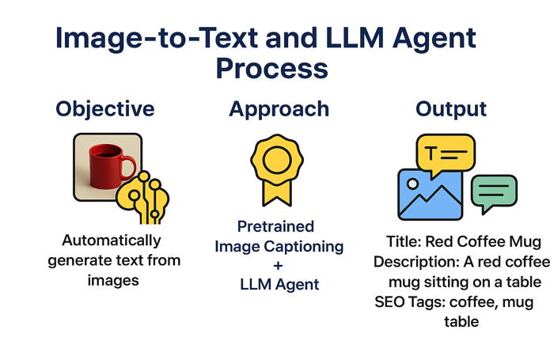

# LLMCourseStudies
This repository contains mini projects developed during the LLM Course.

---


## Product Image to Comment and SEO-Compliant Tag Generation Agent



This project demonstrates an end-to-end pipeline for generating product comments and SEO-friendly tags from product images using state-of-the-art vision-language models and LLMs. The workflow is implemented in the notebook `Product_Image_To_Comment_And_Seo-Compliant_Tag_Generation_Agent.ipynb`.

### Features
- **Image Captioning:** Uses BLIP (Bootstrapped Language-Image Pretraining) to generate a natural language description of a product image.
- **LLM Agent:** Utilizes OpenAI's GPT-4 (via LangChain) to generate a creative product title, a unique product description, and 10 SEO-friendly tags based on the image caption.
- **Streamlit UI:** User-friendly web interface for uploading images and viewing results.

### Prerequisites
- Python 3.8+
- [HuggingFace Transformers](https://huggingface.co/docs/transformers/index)
- [Pillow (PIL)](https://python-pillow.org/)
- [Streamlit](https://streamlit.io/)
- [LangChain](https://python.langchain.com/)
- [python-dotenv](https://pypi.org/project/python-dotenv/)
- OpenAI API key (for GPT-4 access)

### Installation
1. **Clone the repository:**
   ```bash
   git clone <repo-url>
   cd LLMCourseStudies
   ```
2. **Install dependencies:**
   ```bash
   pip install streamlit pillow transformers langchain python-dotenv
   ```
3. **Set up OpenAI API key:**
   - Create a `.env` file in the project root with the following content:
     ```
     OPENAI_API_KEY=sk-...
     ```

### Usage
1. **Run the Streamlit app:**
   ```bash
   streamlit run Product_Image_To_Comment_And_Seo-Compliant_Tag_Generation_Agent.ipynb
   ```
2. **Upload a product image** (JPG, JPEG, PNG) via the web interface.
3. **View the generated product title, description, and SEO tags** in the app output.

### Notes
- The first run will download the BLIP model from HuggingFace and may take a few minutes.
- Make sure your OpenAI API key is valid and has access to GPT-4.
- The notebook can also be run interactively in Jupyter, but the Streamlit interface is recommended for best experience.

### References
- [BLIP: Bootstrapped Language-Image Pretraining (Paper)](https://arxiv.org/abs/2201.12086)
- [BLIP Model on HuggingFace](https://huggingface.co/Salesforce/blip-image-captioning-base)
- [LangChain Documentation](https://python.langchain.com/)
- [Streamlit Documentation](https://docs.streamlit.io/)

---
